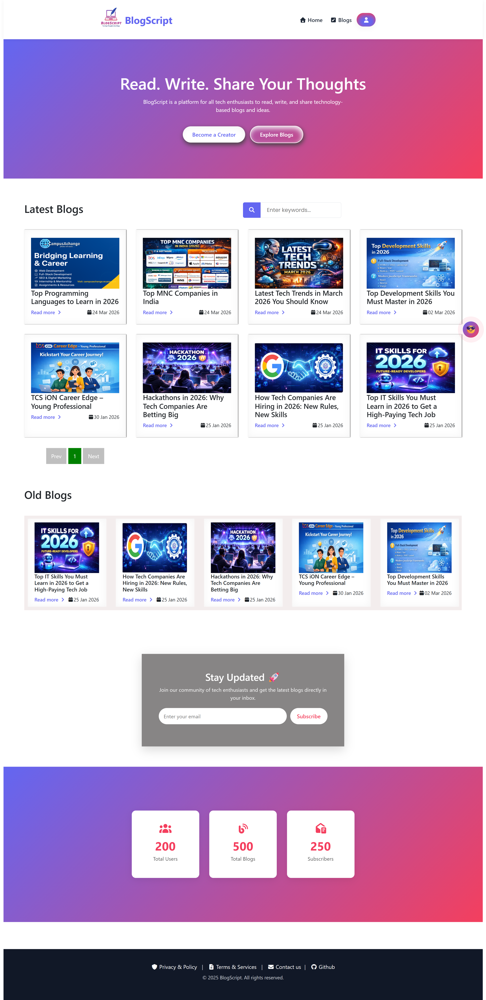

# 📘 BlogScript Blog Web Application

## 🚀 About Project

BlogScript is a CRUD-based Blog Web Application developed using PHP and MySQL. The platform allows users to create, read, update, and delete blog posts securely with authentication and email verification features.

---

## 👨‍💻 Team Members

| Name | Role |
|------|------|
| Pankaj Kumar Das | Backend Developer & Testing |
| Rahul Kumar Senuhar | Frontend Developer |
| Rajneesh Kumar | Documentation & Database |

---

## 🛠️ Tech Stack

### Frontend
- HTML5
- CSS3
- JavaScript
- jQuery

### Backend
- PHP
- PHPMailer

### Database
- MySQL

### Tools
- VS Code
- XAMPP
- phpMyAdmin
- GitHub

---

## ✨ Features

- User Registration & Login
- Email Verification
- Password Reset
- Create Blog Posts
- Edit & Delete Blogs
- Responsive Design
- Secure Authentication
- CRUD Operations

---

## 🔒 Security

- Password Hashing
- Prepared Statements
- SQL Injection Prevention
- Session Management

---

## 📂 Project Modules

- Authentication Module
- Blog Management Module
- Database Module
- Security Module
- Email Integration Module

---

 

